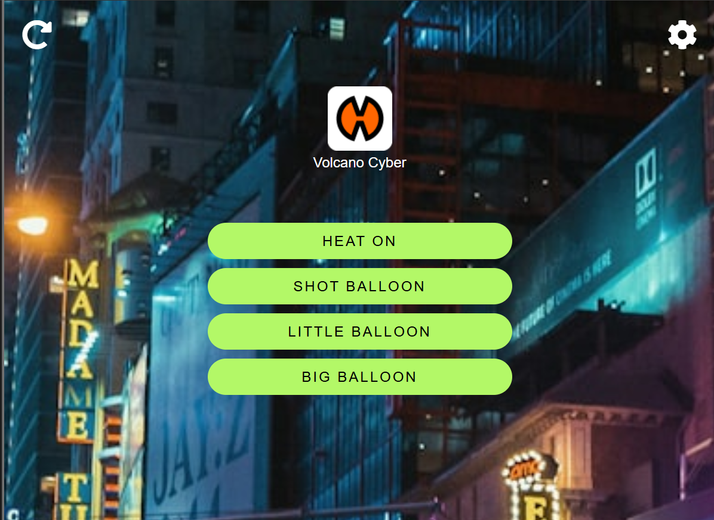
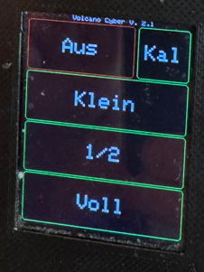

# Volcano Cyber

**Smart Mod for the Storz & Bickel Volcano Digit**
Version: `2.1`

---

## ✨ Features

* Touchscreen UI
* Web Interface
* MQTT Support (Home Assistant compatible)
* Balloon size presets (Shot, Little, Big)
* Calibration mode
* Auto power-off

---

## 🔌 Wiring

See `docs/wiring.jpg` for wiring details.

Connections:

* `GND` → Control board ground (upper right corner)
* `D1` → Power button simulation
* `D2` → Air button simulation

---

## 💻 Hardware

* **Wemos D1 Mini (ESP8266)**
* **2.4" ILI9341 Touchscreen** (Lolin Display Shield)
* Custom 3D-printed case

---

## 🚀 Setup

### ✈ PlatformIO

```
git clone https://github.com/Illustrious-Net-8110/Volcano-Cyber.git
cd volcano-cyber
pio run --target upload         # Flash firmware
pio run --target uploadfs      # Upload web interface
```

---

## 🌐 Web Interface

Access via IP (e.g. `http://192.168.xxx.xxx/`) or via hostname (e.g. `http://volcano-cyber/`) 
Hostname is configurable in src/VolcanoCyber.cpp WIFI_NAME

Includes:

* Heat on/off
* Balloon fill (Shot, Little, Big)
* Auto-refreshing background via Unsplash API (or local fallback)

> To use Unsplash, insert your API key in `/data/js/bg.js`

---

## 📊 MQTT / Home Assistant Integration

MQTT is hardcoded in src/VolcanoCyber.cpp

Via MQTT discovery:

* Air / Heat switches
* Balloon counters
* Usage stats
* Auto-discovery enabled

Requires MQTT broker and Home Assistant setup.
Topics: `volcano_cyber/<chip_id>/...`

---

## ⚠️ Notes

* Original control board is **not modified**, just simulated button presses
* No actual temperature readout yet

---

## 👁️ Screenshots

* 
* 
* 
