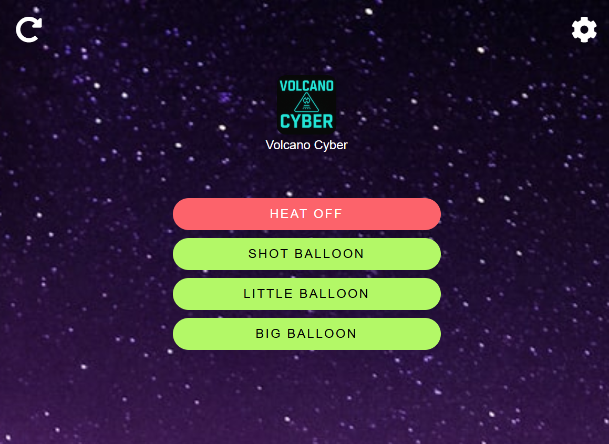
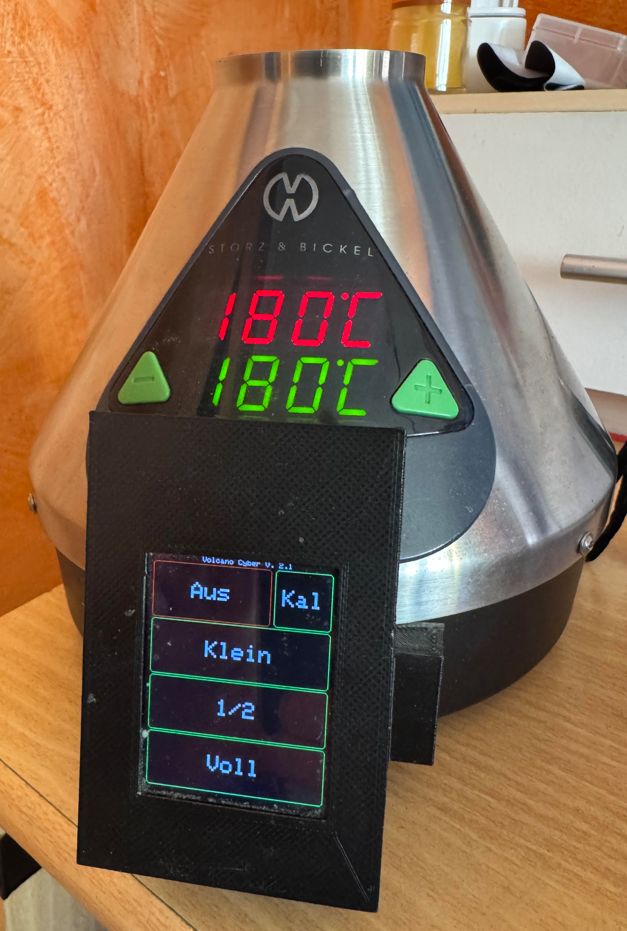
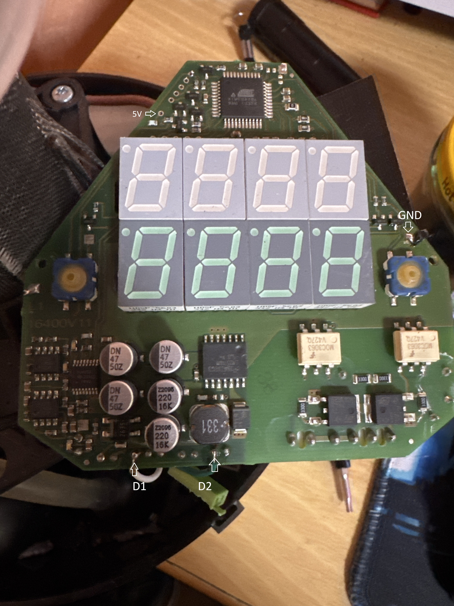

# Volcano Cyber

**Smart Mod for the Storz & Bickel Volcano Digit**
Version: `2.3`

<p align="center">
  
</p>

---

## ✨ Features

* Touchscreen UI
* Web Interface
* MQTT Support (Home Assistant compatible)
* Balloon size presets (Shot, Little, Big)
* Calibration mode
* Auto power-off

---

## 🔌 Wiring

See `docs/wiring.jpg` for wiring details.

Connections:

* `GND` → Control board ground (upper right corner)
* `D1` → Power button 
* `D2` → Air button 

---

## 💻 Hardware

* **Wemos D1 Mini (ESP8266)**
* **2.4" ILI9341 Touchscreen** (Lolin Display Shield)
* Custom 3D-printed case

---

## 🖨️ 3D Models

A big thank you to [andoriusx](https://github.com/andoriusx) for creating these STL files! All models are located in the `/3d_models/` folder.

| File                  | Description                                                                                                          |
|-----------------------|----------------------------------------------------------------------------------------------------------------------|
| **cover.stl**         | Housing for the TFT shield & Wemos. When using the LOLIN Display Shield, the cutout aligns with the Wemos USB port, so you can reflash without removing the module. |
| **mounting-plate.stl**| Mounts to the back of the cover and serves as the connector to the Volcano housing.                                  |
| **screw-left.stl**    | Left counterpart that screws inside the Volcano against the mounting plate (quite fiddly).                          |
| **screw-right.stl**   | Right counterpart mirroring `screw-left.stl` for the opposite side (quite fiddly).                                                  |

> **Note:** Exact screw sizes aren’t documented.

---

## 🚀 Setup

### ✈ PlatformIO

```
git clone https://github.com/Illustrious-Net-8110/Volcano-Cyber.git
cd volcano-cyber
pio run --target upload         # Flash firmware
pio run --target uploadfs      # Upload web interface
```

---

## 🧠 TFT_eSPI Auto-Configuration (LOLIN Display)

This project uses a **custom PlatformIO script** to automatically inject the correct `TFT_eSPI` configuration before each build.

### 🗂️ Setup Files Location

Custom display setups are stored in:
lib/TFT_eSPI_Setups/
├── User_Setup.h
└── User_Setup_Select.h


These are tailored for the **LOLIN TFT Display Shield** (ILI9341, D1 Mini).

## 📱 WiFi Setup

If no WiFi credentials are set, the WiFiManager will open an access point named "Volcano Cyber", which you can connect to.

## 🌐 Web Interface

Access via IP (e.g. `http://192.168.xxx.xxx/`) or via hostname (e.g. `http://volcano-cyber/`) 
Hostname is configurable in src/VolcanoCyber.cpp WIFI_NAME

Includes:

* Heat on/off
* Balloon fill (Shot, Little, Big)
* Auto-refreshing background via Unsplash API (or local fallback)

the web interface is an “installable pwa”. This means you can “install” it in Chrome or add it to the home screen on mobile devices and it runs as a full-screen app

> To use Unsplash, insert your API key in `/data/js/bg.js`

---

## 📊 MQTT / Home Assistant Integration

The mqtt data is queried during WLAN setup.

Via MQTT discovery:

* Air / Heat switches
* Balloon counters
* Usage stats
* Auto-discovery enabled

Requires MQTT broker and Home Assistant setup.
Topics: `volcano_cyber/<chip_id>/...`

---

## 👁️ Screenshots

Webinterface



Touchinterface



Wiring



## Credits

* TFT_eSPI: [https://github.com/Bodmer/TFT_eSPI](https://github.com/Bodmer/TFT_eSPI)
* ESPAsyncTCP-esphome: [https://github.com/ottowinter/ESPAsyncTCP](https://github.com/ottowinter/ESPAsyncTCP)
* ESPAsyncWebServer-esphome: [https://github.com/esphome/ESPAsyncWebServer](https://github.com/esphome/ESPAsyncWebServer)
* ESPAsyncWiFiManager: [https://github.com/alanswx/ESPAsyncWiFiManager](https://github.com/alanswx/ESPAsyncWiFiManager)
* Preferences: [https://github.com/espressif/arduino-esp32/blob/master/libraries/Preferences/src/Preferences.h](https://github.com/espressif/arduino-esp32/blob/master/libraries/Preferences/src/Preferences.h)
* PubSubClient: [https://github.com/knolleary/pubsubclient](https://github.com/knolleary/pubsubclient)
* ArduinoJson: [https://github.com/bblanchon/ArduinoJson](https://github.com/bblanchon/ArduinoJson)
